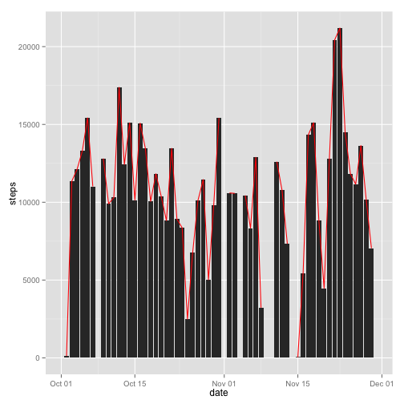
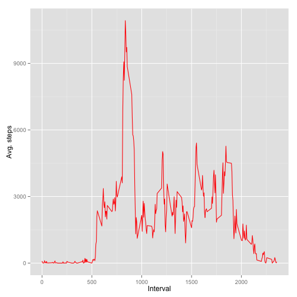
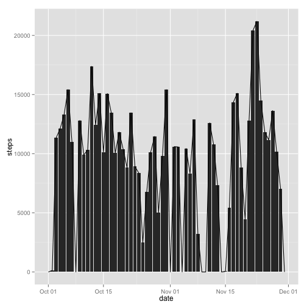
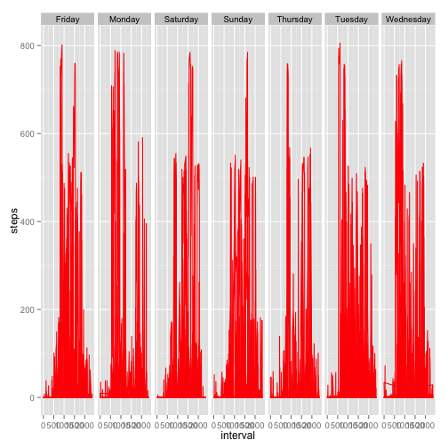

This assignment is intended to perform or extract certain measures through data collected by fitness enthusiasts who might want to observe their fitness behaviour and patterns.  The data here has been downloaded from the course website itself and we'll be exploring some statistics associated with it. Please note that in case for some reason the images won't show up clearly, I would advise to refer to the image files I uploaded with this assignment in the repositry you are in right now.

Firstly, load the relevant packages, namely dplyr, ggplot2 and knitr.


```r
library(dplyr)
library(ggplot2)
library(knitr)
```

# Loading and preprocessing the data
We simply download and store the date set with download.file() function and store it as usual in the functioning directory.

```r
url <- 'https://d396qusza40orc.cloudfront.net/repdata%2Fdata%2Factivity.zip'
download.file(url, destfile = 'activity.zip', method = 'curl')
```

# Reporting mean and median.

Reporting the mean and median of the whole data is rather a simple step. First convert some columns to proper classes and run mean and median functions to extract some important statistics. Executing the summary() is also another good option. Read the data and do necessary changes as required.

```r
activity <- read.csv('activity.csv', sep = ',', header = TRUE)
class(activity$steps)
```

```
## [1] "integer"
```

```r
activity$steps <-as.numeric(activity$steps)
class(activity$interval)
```

```
## [1] "integer"
```

```r
activity$interval <- as.numeric(activity$interval)
activity$date <- as.Date(activity$date, format = '%Y-%m-%d')
activity <- mutate(activity, day = weekdays(activity$date))
```

Calculate total number of steps as instructed in the first part

```r
sum(activity$steps, na.rm = TRUE)
```

```
## [1] 570608
```

Calculate mean and median


```r
mean(activity$steps, na.rm = TRUE)
```

```
## [1] 37.3826
```

```r
median(activity$steps, na.rm = TRUE)
```

```
## [1] 0
```

So what we have here is 37.38 steps as the average figure (seems like a lazy person!) with 0 as the median. The total steps with the NA values ignored comes out to be some 570,608 steps for the whole data.

Time for the next section that requires plotting a bar diagram of total steps taken each day. We do this by forming a grouped data frame and subsequently making a simple bar diagram.

```r
grouped <- activity %>% group_by(date) %>% summarise(steps = sum(steps), na.rm = TRUE)
```

Plot a simple bar diagram with a frequency polygon

```r
ggplot(grouped, aes(date, steps)) +geom_bar(stat = 'identity', na.rm = TRUE) + geom_freqpoly(stat = 'identity', colour = 'red')
```

```
## Warning: Removed 8 rows containing missing values (position_stack).
```

```
## Warning: Removed 2 rows containing missing values (geom_path).
```

 

# Reporting average daily pattern

In this section, we plot a time series of number of average steps taken each day, grouped according to each interval. As we observe, the interval around 580 posesses the maximum number of steps (found out by simple summary() function on the dataset)


```r
byInter = group_by(activity, interval)
inter.final <- summarise(byInter, steps = sum(steps, na.rm = T), mean = mean(steps, na.rm = T), median = median(steps, na.rm = T))
inter.final
```

```
## Source: local data frame [288 x 4]
## 
##    interval steps mean median
## 1         0    91   91     91
## 2         5    18   18     18
## 3        10     7    7      7
## 4        15     8    8      8
## 5        20     4    4      4
## 6        25   111  111    111
## 7        30    28   28     28
## 8        35    46   46     46
## 9        40     0    0      0
## 10       45    78   78     78
## ..      ...   ...  ...    ...
```

```r
ggplot(inter.final, aes(x = interval, y = mean)) + geom_freqpoly(stat = 'identity', colour = 'red') + labs(x = 'Interval', y = 'Avg. steps')
```

 

# Imputing missing values

Reporting NA values is rather a simple process but I was confused first when replacing them. Since the median found was zero, I replaced those NAs with 0 and made a simple histogram. The differences in values seems to be noticeable


```r
sum(is.na(activity))
```

```
## [1] 2304
```

```r
# Replace the NAs with some values. Assuming the median to be 0, replace the NAs with zero
activity[is.na(activity)] <- 0

# Create the new dataset. Simply copy-paste to replicate exact data with NAs filled up
revised <- activity
revised$steps <- as.numeric(revised$steps)

# Create grouped data
group.revised <- revised %>% group_by(date) %>% summarise(steps = sum(steps))

# Plot a similar histogram with the revised dataset
ggplot(group.revised, aes(date,steps)) + geom_bar(stat = 'identity') + geom_freqpoly(stat = 'identity')
```

 

```r
summary(group.revised)
```

```
##       date                steps      
##  Min.   :2012-10-01   Min.   :    0  
##  1st Qu.:2012-10-16   1st Qu.: 6778  
##  Median :2012-10-31   Median :10395  
##  Mean   :2012-10-31   Mean   : 9354  
##  3rd Qu.:2012-11-15   3rd Qu.:12811  
##  Max.   :2012-11-30   Max.   :21194
```

# Reporting on weedays and weekends

This section is for the last part. Insert a 'weekdays' column in the activity dataset and make plots according to each day. A similar pattern for all days is observed, although Friday and Wednesday seem to report the highest steps with I think the least observed during Thursdays.

```r
class(activity$steps)
```

```
## [1] "numeric"
```

```r
activity$steps <- as.numeric(activity$steps)
day.data <- activity %>% group_by(date) %>% summarise(avg.steps = mean(steps))
day.data <- mutate(day.data, weekday = weekdays(day.data$date))
ggplot(activity, aes(x = interval , y = steps)) + geom_freqpoly(stat = 'identity', colour = 'red') + facet_grid(.~day)
```

 

The end.

Hope you liked it.
